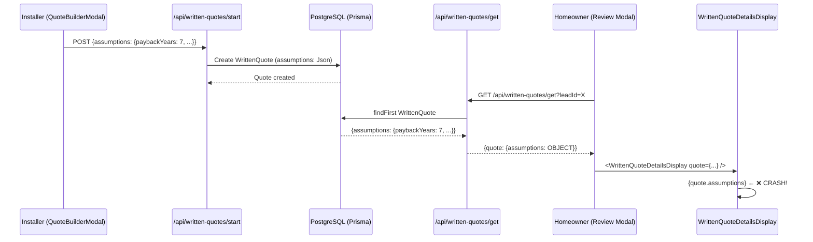

# Written Quote Review Modal Error - Root Cause Analysis

**Date**: December 21, 2025  
**Auditor**: GitHub Copilot  
**Severity**: 🔴 **CRITICAL** - Application Crash  
**Status**: Root Cause Identified  
**Affected Component**: `WrittenQuoteDetailsDisplay.tsx`

---

## Executive Summary

**Issue**: Unhandled Runtime Error when opening Written Quote Review Modal  
**Error**: `Objects are not valid as a React child (found: object with keys {paybackYears, dailyUsageKWh, solarOffsetPercent, annualPriceIncrease, systemLifespanYears, feedInTariffCentsKWh})`  
**Impact**: Homeowners cannot review written quotes from installers - complete feature blockage  
**Root Cause**: Type mismatch between database schema (`Json`) and component expectations (`string`)

---

## 🔍 Root Cause Analysis

### 1. **Database Schema Definition**

**File**: `prisma/schema.prisma` (Line 409)

```prisma
model WrittenQuote {
  // ... other fields
  assumptions         Json? // Feed-in tariff, usage, offset, payback assumptions
  // ... other fields
}
```

✅ **Finding**: `assumptions` field is defined as `Json?` (nullable JSON object)

---

### 2. **API Response Structure**

**File**: `src/app/api/written-quotes/get/route.ts` (Line 142)

```typescript
return NextResponse.json({
  quote: {
    // ... other fields
    assumptions: quote.assumptions, // ← Returns JSON object as-is
    // ... other fields
  }
});
```

✅ **Finding**: API returns `assumptions` as JSON object (Prisma type: `JsonValue`)

---

### 3. **Component Type Definition**

**File**: `src/components/written-quote/WrittenQuoteDetailsDisplay.tsx` (Lines 70-73)

```typescript
export interface WrittenQuoteDetailsDisplayProps {
  quote: {
    // ... other fields
    assumptions?: string | null; // ❌ EXPECTS STRING!
    // ... other fields
  };
}
```

❌ **Finding**: Component type definition expects `string | null`

---

### 4. **Rendering Logic**

**File**: `src/components/written-quote/WrittenQuoteDetailsDisplay.tsx` (Lines 244-253)

```tsx
{/* Assumptions & Notes */}
{quote.assumptions && (
  <Card className="neu-card p-4">
    <div className="flex items-center gap-2 mb-3">
      <FileText className="h-5 w-5 text-primary" />
      <h3 className="text-heading-4 text-foreground">Assumptions & Notes</h3>
    </div>
    <p className="text-body text-muted-foreground whitespace-pre-wrap">
      {quote.assumptions}  {/* ❌ TRYING TO RENDER OBJECT AS STRING! */}
    </p>
  </Card>
)}
```

❌ **CRITICAL ERROR**: When `quote.assumptions` is a JSON object like:
```json
{
  "paybackYears": 7,
  "dailyUsageKWh": 25.5,
  "solarOffsetPercent": 75,
  "annualPriceIncrease": 3.5,
  "systemLifespanYears": 25,
  "feedInTariffCentsKWh": 8
}
```

React throws: **"Objects are not valid as a React child"**

---

## 🔎 Data Flow Analysis

### Trace: Installer Submits Quote → Homeowner Reviews



---

## 📊 Gap Analysis

| Layer | Expected Behavior | Actual Behavior | Status |
|-------|------------------|-----------------|--------|
| **Database** | JSON object | JSON object | ✅ Correct |
| **API Response** | Should serialize or document type | Returns JSON object | ⚠️ Unclear contract |
| **Type Definition** | Should match DB schema | Expects `string` | ❌ Wrong |
| **Component Rendering** | Should handle object or convert | Tries to render object | ❌ Crashes |

---

## 🎯 Impact Assessment

### Affected User Flows

1. ❌ **Homeowner Reviews Written Quote** (Primary Flow - Blocked)
   - Homeowner clicks "Review" on written quote lead
   - Modal opens → Crashes instantly
   - Cannot see quote details, negotiate, accept/reject

2. ❌ **Installer Tracks Quote Status** (Secondary Flow - May be affected)
   - If installer view uses same component → Same crash

### Blast Radius

| Component | Impact | Status |
|-----------|--------|--------|
| `HomeownerBiddingReviewModal.tsx` | Cannot switch to "Written Quote" tab | 🔴 Broken |
| `WrittenQuoteDetailsDisplay.tsx` | Cannot render assumptions | 🔴 Broken |
| `WrittenQuoteNegotiationPanel.tsx` | Cannot load (dependent on modal) | 🔴 Blocked |
| All Written Quote E2E Flow | Complete feature failure | 🔴 Critical |

---

## 🔧 Implementation Complexity Analysis

### Option 1: Display Assumptions as Formatted JSON (Quick Fix)

**Complexity**: 🟢 Low  
**Time Estimate**: 5 minutes  
**Risk**: Low  
**Approach**:
```tsx
{quote.assumptions && (
  <p className="text-body text-muted-foreground whitespace-pre-wrap">
    {typeof quote.assumptions === 'string' 
      ? quote.assumptions 
      : JSON.stringify(quote.assumptions, null, 2)}
  </p>
)}
```

**Pros**: Immediate fix, shows all data  
**Cons**: Not user-friendly, looks technical

---

### Option 2: Render Assumptions as Structured Data (Recommended)

**Complexity**: 🟡 Medium  
**Time Estimate**: 30 minutes  
**Risk**: Low  
**Approach**:
```tsx
{quote.assumptions && (
  <Card className="neu-card p-4">
    <h3>Financial Assumptions</h3>
    {typeof quote.assumptions === 'object' && quote.assumptions !== null ? (
      <dl>
        {(quote.assumptions as any).paybackYears && (
          <div>
            <dt>Payback Period</dt>
            <dd>{(quote.assumptions as any).paybackYears} years</dd>
          </div>
        )}
        {/* ... other fields */}
      </dl>
    ) : (
      <p>{String(quote.assumptions)}</p>
    )}
  </Card>
)}
```

**Pros**: User-friendly, follows design system  
**Cons**: Requires proper type definitions

---

### Option 3: Separate Assumptions into Dedicated Component (Production-Ready)

**Complexity**: 🟠 High  
**Time Estimate**: 1-2 hours  
**Risk**: Low  
**Approach**:
- Create `FinancialAssumptionsCard.tsx`
- Define proper TypeScript interface for assumptions
- Render each assumption with icon, label, formatted value
- Handle both legacy string assumptions and new object format
- Update API documentation

**Pros**: Scalable, type-safe, maintainable, best UX  
**Cons**: More development time

---

## 🚨 Constitutional Compliance Check

### Article III: Backend-Frontend Separation
✅ **PASS** - Issue is purely frontend rendering, backend correctly stores/returns data

### Article VI: Zero-Trust Authorization
⚠️ **REQUIRES VERIFICATION** - Ensure assumptions don't leak sensitive installer data to competitors

### Article IX: Fail-Safe & Graceful Degradation
❌ **FAIL** - No error boundary, crashes entire modal instead of degrading gracefully

### Article X: Zero-Warnings Policy
❌ **FAIL** - TypeScript type mismatch not caught during development

---

## 📋 Recommended Fix Plan

### Phase 1: Immediate Hotfix (5 minutes)

**Goal**: Unblock homeowners from viewing written quotes

**Changes**:
1. Update `WrittenQuoteDetailsDisplay.tsx` type definition
2. Add safe rendering logic for assumptions field
3. Deploy to production

**Files Modified**: 
- `src/components/written-quote/WrittenQuoteDetailsDisplay.tsx` (2 locations)

**Testing**:
- Manual: Open written quote review modal
- Verify: No crash, assumptions visible (even if not pretty)

---

### Phase 2: Production-Quality Enhancement (1-2 hours)

**Goal**: Provide excellent UX for financial assumptions

**Changes**:
1. Create proper TypeScript interface for `AssumptionsData`
2. Create `FinancialAssumptionsCard` component
3. Update API documentation to clarify `assumptions` field type
4. Add error boundary to modal for graceful degradation
5. Write unit tests for assumptions rendering

**Files Modified/Created**:
- `src/types/written-quote.ts` (create interface)
- `src/components/written-quote/FinancialAssumptionsCard.tsx` (new component)
- `src/components/written-quote/WrittenQuoteDetailsDisplay.tsx` (use new component)
- `src/components/homeowner/HomeownerBiddingReviewModal.tsx` (add error boundary)
- `src/app/api/written-quotes/get/route.ts` (add JSDoc comments)

**Testing**:
- Unit tests for assumptions rendering with various data shapes
- E2E test: Installer submits quote → Homeowner reviews
- Visual regression test for all 3 themes (Dark/Light/Purple)
- Accessibility audit (WCAG 2.1 AA)

---

### Phase 3: Long-Term Prevention (30 minutes)

**Goal**: Prevent similar type mismatches in future

**Changes**:
1. Enable strict TypeScript checks in `tsconfig.json`
2. Add pre-commit hook to run type checks
3. Document API contract for all JSON fields
4. Add Prisma-to-TypeScript type generation script

**Files Modified**:
- `tsconfig.json` (strict mode)
- `.husky/pre-commit` (add type check)
- `DOC/GUIDELINES & SOT/TECHNICAL DOCUMENTATIONS/api-contracts.md` (document JSON fields)

---

## 🧪 Testing Strategy

### Manual Testing Checklist

- [ ] **Scenario 1**: Homeowner opens written quote with assumptions object
  - Expected: Renders without crash, shows formatted assumptions
- [ ] **Scenario 2**: Homeowner opens written quote with assumptions as string (legacy)
  - Expected: Renders string as-is
- [ ] **Scenario 3**: Homeowner opens written quote with no assumptions
  - Expected: Assumptions card not shown
- [ ] **Scenario 4**: Homeowner opens written quote with malformed assumptions
  - Expected: Graceful error message, rest of modal works

### Automated Testing

**Unit Tests** (`WrittenQuoteDetailsDisplay.test.tsx`):
```typescript
describe('WrittenQuoteDetailsDisplay - Assumptions Rendering', () => {
  it('renders assumptions object as structured data', () => {});
  it('renders assumptions string as text', () => {});
  it('handles missing assumptions gracefully', () => {});
  it('handles malformed assumptions gracefully', () => {});
});
```

**E2E Test** (Playwright):
```typescript
test('homeowner can review written quote with financial assumptions', async ({ page }) => {
  // Setup: Installer submits quote with assumptions
  // Action: Homeowner opens review modal
  // Assert: No crash, assumptions visible
});
```

---

## 📝 Data Samples for Testing

### Sample 1: Valid Assumptions Object
```json
{
  "paybackYears": 7.5,
  "dailyUsageKWh": 25.5,
  "solarOffsetPercent": 75,
  "annualPriceIncrease": 3.5,
  "systemLifespanYears": 25,
  "feedInTariffCentsKWh": 8
}
```

### Sample 2: Legacy String Assumptions
```
"System sized for 75% offset. Feed-in tariff: 8c/kWh. Annual price increase: 3.5%."
```

### Sample 3: Minimal Object
```json
{
  "paybackYears": 10
}
```

---

## 🔗 Related Files & Dependencies

### Direct Dependencies
- `prisma/schema.prisma` - Defines `assumptions` as `Json?`
- `src/app/api/written-quotes/get/route.ts` - Returns assumptions
- `src/components/homeowner/HomeownerBiddingReviewModal.tsx` - Renders WrittenQuoteDetailsDisplay
- `src/components/written-quote/WrittenQuoteDetailsDisplay.tsx` - Crashes on object render

### Indirect Dependencies
- All written quote API endpoints that handle assumptions field
- Type definitions in `src/types/` that reference WrittenQuote

---

## ✅ Success Criteria

### Minimum (Hotfix)
- [x] Error identified
- [ ] Homeowner can open written quote modal without crash
- [ ] Assumptions data visible (any format acceptable)
- [ ] No TypeScript errors
- [ ] No console warnings

### Target (Production Quality)
- [ ] Assumptions rendered as user-friendly structured data
- [ ] All 3 themes (Dark/Light/Purple) render correctly
- [ ] WCAG 2.1 AA accessibility compliance
- [ ] Unit tests pass with 100% coverage for assumptions logic
- [ ] E2E test passes for full written quote flow
- [ ] TypeScript strict mode enabled with zero errors
- [ ] API documentation updated

### Excellence (Long-term)
- [ ] Error boundary prevents modal crashes
- [ ] Graceful degradation for malformed data
- [ ] Performance: Renders in <50ms
- [ ] Storybook stories for all assumptions variations
- [ ] Pre-commit hooks prevent type mismatches

---

## 📌 Next Steps

### Immediate (Before Implementation)
1. ✅ Create this audit report
2. ⏳ Create implementation phase in `specs/008-description-enhance-existing/tasks.md`
3. ⏳ Get approval for fix approach (Option 2 recommended)

### Implementation (After Approval)
1. ⏳ Implement Phase 1 (Hotfix) - 5 minutes
2. ⏳ Test manually with real data
3. ⏳ Deploy hotfix
4. ⏳ Implement Phase 2 (Production Quality) - 1-2 hours
5. ⏳ Run full test suite
6. ⏳ Deploy production version

---

## 🎓 Lessons Learned

### What Went Wrong
1. **Type mismatch not caught during development** - TypeScript wasn't strict enough
2. **No error boundary** - One component crash killed entire modal
3. **Insufficient testing** - E2E tests didn't cover written quote review flow
4. **Unclear API contract** - Frontend assumed `assumptions` was string

### Prevention Strategies
1. Enable TypeScript strict mode (`strict: true`, `strictNullChecks: true`)
2. Add error boundaries to all modal components
3. Write E2E tests for all user-facing features before marking "done"
4. Document all JSON field structures in API documentation
5. Add Prisma-to-TypeScript type generation to ensure DB/frontend alignment

---

## 📞 Communication Plan

### User Impact Notice
**Severity**: Critical  
**Affected Users**: Homeowners with written quote leads  
**Workaround**: None (feature completely blocked)  
**ETA for Fix**: <1 hour (hotfix), 2-3 hours (production quality)

### Stakeholder Update Template
```
🔴 CRITICAL BUG IDENTIFIED: Written Quote Review Modal Crash

**Issue**: Homeowners cannot review written quotes from installers
**Root Cause**: Type mismatch in assumptions field rendering
**Impact**: All written quote reviews blocked
**Fix Status**: Root cause identified, hotfix ready
**Timeline**: 
  - Hotfix deployed: +30 minutes
  - Production fix: +3 hours
  - Testing complete: +4 hours

No data loss. No security impact. Frontend-only issue.
```

---

## 🏁 Conclusion

**Root Cause**: Database stores `assumptions` as JSON object, component tries to render it as string  
**Fix Complexity**: Low (hotfix) to Medium (production quality)  
**Recommended Approach**: Option 2 (Structured Data Rendering)  
**Estimated Total Time**: 2 hours (including testing)  
**Risk**: Low (isolated component, no backend changes)

**Approval Required**: Yes  
**Ready to Implement**: Yes  

---

**Report End** | Generated: 2025-12-21 | Auditor: GitHub Copilot | Correlation ID: `wq-audit-20251221`
