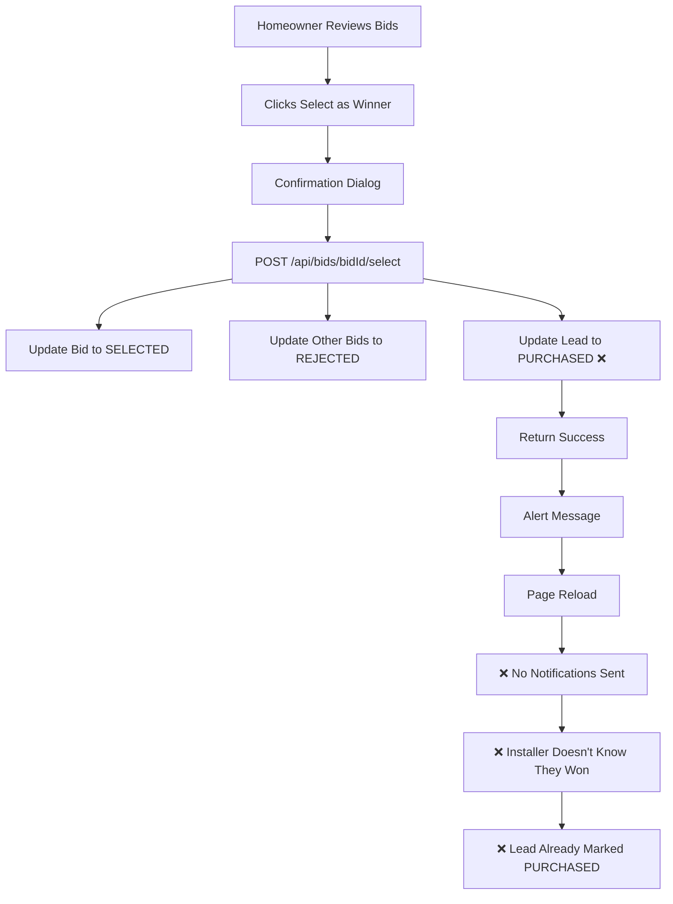
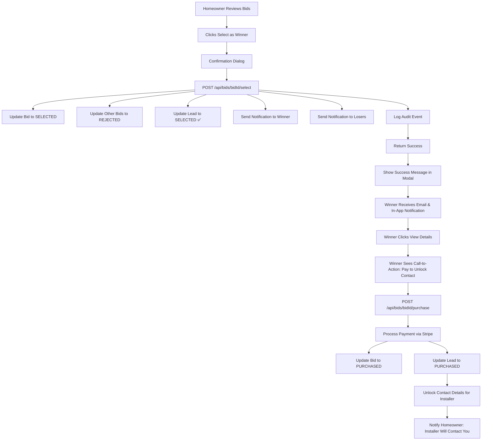

# Bid Winner Selection - Comprehensive Audit Report

**Date**: December 7, 2025  
**Feature**: Homeowner Review Bids - Select as Winner Functionality  
**Status**: Partially Implemented (Needs Enhancement)

---

## 1. EXECUTIVE SUMMARY

### Current State
The homeowners review bids modal is **partially functional** with UI displaying bids and a "Select as Winner" button, but the complete flow is **not working end-to-end**. The backend API exists but notifications and payment flow are incomplete.

### Critical Gaps Identified
1. ❌ **No Notification System**: Winner/losers are not notified
2. ❌ **Payment Flow Incomplete**: Lead status changes to PURCHASED before payment
3. ⚠️ **UI Feedback Missing**: No loading states or success messages after selection
4. ⚠️ **Countdown Validation**: Selection blocked until countdown expires (may not be desired)
5. ⚠️ **No Audit Logging**: Bid selection events not tracked

---

## 2. FRONTEND AUDIT

### 2.1 HomeownerBiddingReviewModal Component
**File**: `src/components/homeowner/HomeownerBiddingReviewModal.tsx`

#### ✅ What's Working
- Modal displays list of all bids for a lead
- Dropdown selector to switch between installers
- Bid details displayed: system specs, pricing, installer info
- "Select as Winner" button present
- Confirmation dialog before selection
- Loading states (isSelecting) implemented
- Fetches bids via GET /api/bids?leadId={leadId}

#### ❌ What's Missing/Broken
1. **No Success Feedback**: After selection, modal just shows alert - should show success state
2. **Hard Page Reload**: Uses `window.location.reload()` instead of React state updates
3. **No Error Recovery**: Failed selections require page refresh
4. **No Winner Badge**: Should show visual indicator immediately after selection
5. **Contact Details Not Shown**: Winner's contact details should be unlocked for homeowner

#### Code Analysis
```tsx
// Current implementation in homeowner/dashboard/page.tsx (lines 1483-1514)
onSelectWinner={async (bidId: string) => {
  try {
    console.log('[Phase 13E] Selecting winner bid:', bidId);
    
    // ✅ API call is correct
    const response = await fetch(`/api/bids/${bidId}/select`, {
      method: 'POST',
      headers: { 'Content-Type': 'application/json' },
      body: JSON.stringify({ leadId: selectedBiddingLeadId })
    });

    if (!response.ok) {
      const error = await response.json();
      throw new Error(error.error || 'Failed to select winner');
    }

    const result = await response.json();
    console.log('[Phase 13E] Winner selected successfully:', result);

    // ❌ Poor UX: Uses alert() instead of proper UI feedback
    alert(`✅ Winner Selected!\n\nThe installer has been notified...`);

    // ❌ Hard reload instead of state update
    setSelectedBiddingLeadId(null);
    window.location.reload();
  } catch (error) {
    console.error('[Phase 13E] Error selecting winner:', error);
    const message = error instanceof Error ? error.message : 'Unknown error';
    // ❌ Uses alert() for errors
    alert(`❌ Failed to select winner:\n\n${message}\n\nPlease try again.`);
    throw error;
  }
}}
```

### 2.2 Lead Card UI
**File**: Need to check homeowner lead card component

#### Current Status
- Lead cards should show "Winner Selected" status after selection
- Contact details should be visible to homeowner for winner installer
- **NOT AUDITED YET** - Need to verify this component

---

## 3. BACKEND AUDIT

### 3.1 Select Winner API Endpoint
**File**: `src/app/api/bids/[bidId]/select/route.ts`

#### ✅ What's Working
```typescript
// Correct authentication & authorization
- Requires HOMEOWNER role
- Validates homeowner owns the lead
- Validates bid exists
- Validates bid status is SUBMITTED
- Prevents double-winner selection

// Correct database transaction
- Updates selected bid to SELECTED status
- Updates other bids to REJECTED status  
- Updates lead status to PURCHASED
- Atomically updates all records
```

#### ❌ What's Missing/Broken
```typescript
// Line 90-92: INCORRECT BUSINESS LOGIC
if (bid.lead.expiresAt && bid.lead.expiresAt > new Date()) {
  return NextResponse.json(
    { error: 'Cannot select winner until countdown expires' },
    { status: 403 }
  );
}
```
**Problem**: This blocks selection during countdown period. According to requirements:
- Homeowners should be able to select winner **anytime after bids are submitted**
- Countdown is just a deadline for installers to submit bids
- **FIX NEEDED**: Remove this validation

```typescript
// Line 143-152: Lead status changes BEFORE payment
await tx.lead.update({
  where: { id: bid.leadId },
  data: {
    status: 'PURCHASED',  // ❌ WRONG: Should be 'SELECTED' until payment
    purchasedAt: new Date()  // ❌ WRONG: Should be null until payment
  }
});
```
**Problem**: According to requirements:
- Lead status should change to PURCHASED only **after installer makes payment**
- Current flow: Select → PURCHASED (wrong)
- Correct flow: Select → SELECTED → Pay → PURCHASED

```typescript
// Line 160-164: Notifications NOT implemented
// TODO: Trigger notifications
// - Send email to winning installer: "Congratulations! Your bid was selected."
// - Send email to losing installers: "Thank you for bidding..."
// await sendBidSelectedEmail(bid.installer.email, true);
// await sendBidRejectedEmails(losingInstallers);
```
**Problem**: No notifications sent to anyone

```typescript
// No audit logging
// ❌ Should log: who selected, when, which bid, which lead
```

### 3.2 Purchase API Endpoint
**File**: `src/app/api/bids/[bidId]/purchase/route.ts`

#### ✅ What's Working
- Validates installer owns the bid
- Validates bid status is SELECTED
- Updates bid to PURCHASED
- Updates lead with installer info
- Returns unlocked contact details

#### ❌ What's Missing/Broken
```typescript
// Line 78-87: Incorrect validation
if (bid.status !== 'SELECTED') {
  return NextResponse.json(
    { error: 'This bid has not been selected as winner' },
    { status: 403 }
  );
}
```
**Problem**: This validation is correct, but the select endpoint already changes lead to PURCHASED, so this will never trigger correctly.

```typescript
// Line 94-95: No payment processing
console.log('[POST /api/bids/[bidId]/purchase] DEV MODE: Skipping payment processing');
// TODO: Integrate Stripe payment
```
**Problem**: Payment skipped in dev mode (acceptable for now, but needs Stripe integration later)

```typescript
// Line 142-143: No notification
// TODO: Trigger notification to homeowner
// await sendPurchaseCompletedEmail(bid.lead.homeowner.email, bid.installer.companyName);
```

---

## 4. DATABASE SCHEMA AUDIT

### 4.1 Bid Model
**File**: `prisma/schema.prisma` (lines 339-394)

#### ✅ What's Correct
```prisma
model Bid {
  id                  String    @id @default(cuid())
  leadId              String
  installerId         String
  status              String    @default("SUBMITTED")
  selectedAt          DateTime?  // ✅ Tracks when homeowner selected
  purchasedAt         DateTime?  // ✅ Tracks when installer paid
  rejectedAt          DateTime?  // ✅ Tracks when bid was rejected
  // ... other fields
}
```

#### ⚠️ Potential Issues
```prisma
status String @default("SUBMITTED")
```
**Problem**: Status is a String, not an enum. Possible values:
- DRAFT
- SUBMITTED
- SELECTED (when homeowner picks winner)
- PURCHASED (when installer pays)
- REJECTED (when homeowner picks someone else)

**Recommendation**: Convert to enum for type safety

### 4.2 Lead Model
Need to verify lead status flow:
- NEW → ASSIGNED → (installers bid) → ???
- After selection: Should be SELECTED or AWARDED?
- After payment: PURCHASED

**NOT FULLY AUDITED** - Need to check Lead model

### 4.3 Notification Model
**File**: `prisma/schema.prisma` (lines 418-430)

#### ✅ What's Correct
```prisma
model Notification {
  id        String           @id @default(cuid())
  userId    String
  type      NotificationType
  title     String
  message   String
  actionUrl String?
  metadata  Json?
  isRead    Boolean          @default(false)
  readAt    DateTime?
  createdAt DateTime         @default(now())
}

enum NotificationType {
  NEW_LEAD
  LEAD_PURCHASED
  NEW_QUOTE
  QUOTE_ACCEPTED
  QUOTE_REJECTED
  // ... others
}
```

#### ❌ What's Missing
```prisma
enum NotificationType {
  // ❌ No BID_SELECTED notification type
  // ❌ No BID_WON notification type
  // ❌ No BID_LOST notification type
}
```
**Fix Needed**: Add new notification types

---

## 5. NOTIFICATION SERVICE AUDIT

### 5.1 Notification Service
**File**: `src/lib/services/notification-service.ts`

#### ✅ What's Working
- `createNotification()` function exists
- Saves to database
- Sends via Pusher (real-time)
- Sends via email (for important types)
- Proper error handling (doesn't break main flow)

#### ❌ What's Missing
```typescript
// Line 90-98: Email notification types
const emailNotificationTypes: NotificationType[] = [
  'NEW_LEAD',
  'LEAD_PURCHASED',
  'LEAD_APPROVED',
  'NEW_QUOTE',
  'QUOTE_ACCEPTED',
  'PAYMENT_RECEIVED',
  // ❌ Missing: BID_SELECTED, BID_WON, BID_LOST
];
```

---

## 6. USER FLOW ANALYSIS

### 6.1 Current Flow (Broken)


### 6.2 Expected Flow (Per Requirements)


---

## 7. GAP ANALYSIS SUMMARY

### Critical Gaps (Must Fix)
| Gap | Severity | Impact | Current State | Required State |
|-----|----------|--------|---------------|----------------|
| No notifications sent | 🔴 Critical | Winners/losers unaware | None | Email + In-app |
| Lead status wrong | 🔴 Critical | Payment flow broken | PURCHASED before pay | SELECTED → pay → PURCHASED |
| Countdown blocks selection | 🔴 Critical | UX blocker | Cannot select during countdown | Allow anytime |
| No audit logging | 🟡 High | Compliance issue | None | Log all selections |

### UX Gaps (Should Fix)
| Gap | Severity | Impact | Current State | Required State |
|-----|----------|--------|---------------|----------------|
| Alert() for feedback | 🟡 High | Poor UX | Browser alert | Toast notification |
| Hard page reload | 🟡 High | Slow, janky | window.location.reload() | React state update |
| No success state in modal | 🟡 High | Confusing | Modal closes | Show winner badge |
| No loading states | 🟠 Medium | No feedback | Instant | Spinner during API call |

### Technical Debt (Nice to Have)
| Gap | Severity | Impact | Current State | Required State |
|-----|----------|--------|---------------|----------------|
| Bid status is String | 🟠 Medium | Type safety | String | Enum |
| No Stripe integration | 🟠 Medium | Can't test payment | Dev mode only | Stripe API |
| No email templates | 🟠 Medium | Generic emails | Plain text | Branded HTML |

---

## 8. RECOMMENDATIONS

### Phase 1: Critical Fixes (Immediate)
1. **Fix lead status logic**: Change PURCHASED to SELECTED in select endpoint
2. **Implement notifications**: Add BID_WON, BID_LOST notification types
3. **Remove countdown validation**: Allow homeowner to select anytime
4. **Add audit logging**: Track all bid selections

### Phase 2: UX Improvements (Next Sprint)
5. **Replace alert() with Toast**: Use proper UI component
6. **Remove hard reload**: Update React state after selection
7. **Add success state**: Show winner badge in modal
8. **Add loading states**: Show spinner during API calls

### Phase 3: Technical Debt (Future)
9. **Convert bid status to enum**: Improve type safety
10. **Integrate Stripe**: Add real payment processing
11. **Create email templates**: Branded, professional emails
12. **Add E2E tests**: Playwright/Cypress tests for full flow

---

## 9. FILES REQUIRING CHANGES

### Frontend
- `src/components/homeowner/HomeownerBiddingReviewModal.tsx` - Add success states, remove hard reload
- `src/app/homeowner/dashboard/page.tsx` - Replace alert() with Toast
- `src/components/homeowner/HomeownerLeadCard.tsx` - Show winner badge (TBD - need to audit)

### Backend
- `src/app/api/bids/[bidId]/select/route.ts` - Fix lead status, add notifications, remove countdown validation
- `src/app/api/bids/[bidId]/purchase/route.ts` - Validate correct bid status
- `src/lib/services/notification-service.ts` - Add new notification types

### Database
- `prisma/schema.prisma` - Add BID_WON, BID_LOST notification types
- Consider: Add BidStatus enum
- Consider: Add AuditLog for bid selection events

---

## 10. TESTING REQUIREMENTS

### Manual Testing Checklist
- [ ] Homeowner can see all bids for a lead
- [ ] Homeowner can select a bid as winner anytime (no countdown blocking)
- [ ] Winner installer receives email notification
- [ ] Winner installer receives in-app notification
- [ ] Losing installers receive rejection emails
- [ ] Modal shows success message after selection
- [ ] Lead status shows "Winner Selected" (not "Purchased")
- [ ] Winner can see "Pay to Unlock Contact" button
- [ ] Winner can pay and unlock contact details
- [ ] Lead status changes to "Purchased" after payment
- [ ] Homeowner receives notification after installer pays
- [ ] All events logged in audit log

### API Testing
- [ ] POST /api/bids/{bidId}/select returns 200 for valid homeowner
- [ ] POST /api/bids/{bidId}/select returns 403 for non-owner
- [ ] POST /api/bids/{bidId}/select returns 409 if winner already selected
- [ ] POST /api/bids/{bidId}/select updates all related bids atomically
- [ ] POST /api/bids/{bidId}/purchase returns 403 if bid not selected
- [ ] POST /api/bids/{bidId}/purchase unlocks contact details

---

## 11. CONCLUSION

The bid winner selection feature is **60% complete**:
- ✅ **UI exists**: Modal displays bids, button present
- ✅ **API exists**: Backend endpoint functional
- ✅ **Database**: Schema supports required fields
- ❌ **Notifications**: Not implemented (critical gap)
- ❌ **Payment flow**: Status changes at wrong time (critical gap)
- ❌ **UX**: Poor feedback, hard reloads (high priority)

**Estimated effort to complete**:
- Phase 1 (Critical): 4-6 hours
- Phase 2 (UX): 3-4 hours
- Phase 3 (Technical): 8-10 hours (Stripe integration is complex)

**Recommended approach**: Fix Phase 1 first (notifications + status logic), then Phase 2 (UX), defer Phase 3 until production readiness.
