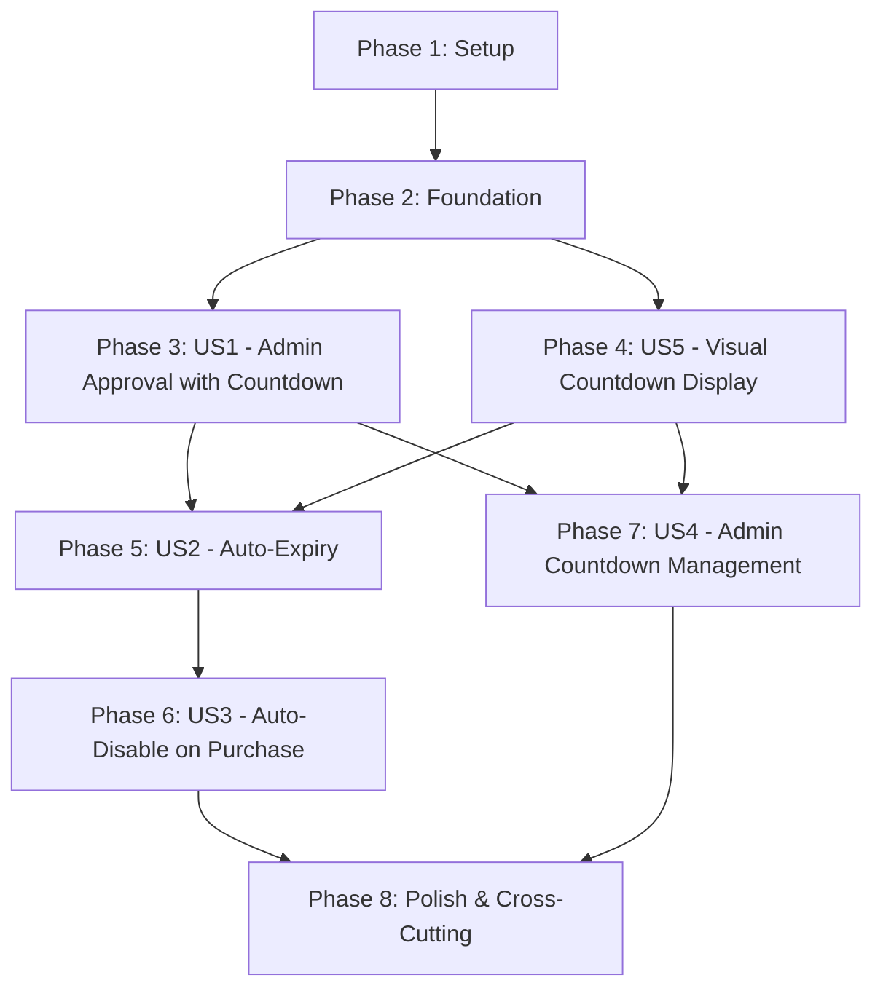

# Tasks: Lead Expiry Countdown Timer

**Feature Branch**: `003-countdown-timer-for`  
**Input**: Design documents from `/specs/003-countdown-timer-for/`  
**Prerequisites**: ✅ plan.md, ✅ spec.md, ✅ research.md, ✅ data-model.md, ✅ contracts/  
**Tests**: Not requested in specification - excluded from task list  
**Organization**: Tasks are grouped by user story to enable independent implementation and testing

## Format: `[ID] [P?] [Story] Description`
- **[P]**: Can run in parallel (different files, no dependencies)
- **[Story]**: Which user story this task belongs to (US1-US5, Setup, Foundation, Polish)
- File paths follow Next.js App Router conventions

---

## ⚠️ MANDATORY WORKFLOW FOR EACH PHASE

### Before Starting Any Phase:
1. **Pre-Phase Audit & Planning** (30-60 minutes):
   - Read ALL spec files thoroughly (`spec.md`, `data-model.md`, `contracts/countdown-api.openapi.yaml`)
   - Map out EXACT data structures from spec (don't invent new ones)
   - Identify existing code patterns to follow (auth, services, API routes)
   - Verify Prisma schema matches spec BEFORE writing any code
   - List all files to create/modify with their exact purposes
   - Verify external dependencies are installed and configured
   - Document any spec ambiguities - ASK USER before assuming
   - **RULE**: If spec says use existing `expiresAt` field, use it. Don't add new fields mid-implementation.

### During Phase Implementation:
2. **Spec-Driven Implementation** (Task by Task):
   - **For each task**: Re-read relevant spec section FIRST
   - Copy exact field names, types, and structures from spec
   - Follow existing code patterns (e.g., how other services are structured)
   - Use EXISTING utilities (don't reinvent: getSetting, createAuditLog, etc.)
   - Check function signatures in services BEFORE calling them
   - **Incremental Build Check**: After every 3-5 tasks, run `npm run build`
     - If errors appear: FIX according to spec, not by changing architecture
     - Don't create "temporary workarounds" that contradict spec
   - **Type Safety First**: Let TypeScript errors guide you to spec compliance
     - Missing field? Check spec - should it exist in schema?
     - Wrong type? Check spec - is service signature correct?
   - **No Spec Drift**: If you modify Prisma schema, it should already exist per spec (expiresAt field)
   - **Manual QA Checklist Required**: For any task that includes BOTH backend and frontend changes, add a short "Manual QA Checklist" directly under that task with steps to validate UI states, API calls (success and one error path), and data accuracy.

3. **Post-Phase Validation** (MUST COMPLETE BEFORE COMMIT):
   - ✅ **Schema Validation**: Run `npx prisma validate` - schema must match spec
   - ✅ **Type Check**: Run `npx tsc --noEmit` - all TypeScript must be valid
   - ✅ **Build**: Run `npm run build` - MUST pass with 0 errors
     - **Build Error Protocol**:
       1. Read error message carefully
       2. Check spec: Is implementation following spec exactly?
       3. Fix by aligning with spec, NOT by changing architecture
       4. If spec is ambiguous: STOP, document issue, ask user
       5. **Time Limit**: If fixing takes >30 min, STOP and report to user
   - ✅ **Lint**: Run `npm run lint` - fix critical issues only
   - ✅ **Manual Spot Check**: Open 2-3 key files, verify they match spec intent
   - ✅ **Task Checklist**: Every task T### must be checked off with proof
   - ✅ **Regression Check**: Run dev server, verify existing features still work

4. **Commit Approval** (MANDATORY):
   - ❌ **NEVER commit without explicit user approval**
   - Present validation results:
     - Build output (success/warnings)
     - Files changed count
     - Key changes summary
     - Any deviations from spec (with justification)
   - Wait for user confirmation: "Yes, commit this phase"
   - Only then: `git add .` → `git commit -m "Phase X: <summary>"`

### Phase Completion Criteria:
- ✅ All tasks marked complete with evidence
- ✅ Implementation matches spec exactly (data model, API contracts, types)
- ✅ Prisma schema validated
- ✅ TypeScript compiles with no errors
- ✅ Build passes (`npm run build`)
- ✅ No critical lint errors
- ✅ No spec drift or architectural changes mid-phase
- ✅ User approval received
- ✅ Git commit created with detailed message

### 🚨 RED FLAGS - STOP IMMEDIATELY:
- Schema doesn't match spec → Review spec, verify expiresAt field exists
- Service function signatures differ from usage → Check existing services, align
- Build errors persist >30 minutes → Report to user, don't spiral
- Creating new patterns not in existing codebase → Use existing patterns
- Inventing field names not in spec → Use exact spec names
- "I'll fix it later" thoughts → Fix now according to spec, or ask user

---

## 🛡️ BUILD ERROR PREVENTION CHECKLIST

**Use this BEFORE writing any integration code:**

### 1. Schema Verification (5 min)
```bash
# Check Prisma schema for exact model structure
cat prisma/schema.prisma | grep -A 20 "model Lead"

# Validate schema is correct
npx prisma validate

# Verify expiresAt field exists
grep "expiresAt" prisma/schema.prisma
```

### 2. Service Signature Verification (10 min)
```bash
# Check what a service actually exports
grep "^export" src/lib/services/settings-service.ts

# Check function signatures
grep "export async function" src/lib/services/countdown-service.ts -A 3

# Example: Before calling getSetting()
grep "export.*getSetting" src/lib/services/settings-service.ts -A 5
```

### 3. Type Verification (5 min)
```bash
# Check NextAuth session type
grep -A 20 "interface Session" src/types/next-auth.d.ts

# Check if field exists in session.user
grep "interface.*User" src/lib/auth.ts -A 10

# Check Prisma Client types
grep "expiresAt" node_modules/.prisma/client/index.d.ts
```

### 4. Existing Patterns Review (10 min)
- Open 2-3 similar existing files (e.g., if creating countdown-service.ts, read lead-state.ts)
- Note how they import Prisma client: `import { prisma } from '@/lib/prisma'`
- Note how they handle errors: try/catch patterns
- Note how they call other services: `await createAuditLog({ ... })`
- Copy-paste patterns, don't reinvent

### 5. Pre-Implementation Checklist
- [ ] Read spec section for this task completely
- [ ] Verified Prisma schema has expiresAt field (already exists per spec)
- [ ] Verified all service functions I'll call actually exist with correct signatures
- [ ] Confirmed all types I'll use exist and have required fields
- [ ] Reviewed 1-2 similar existing files for patterns
- [ ] Identified all imports needed (services, types, Prisma)
- [ ] Know exact field names from spec (expiresAt, not countdownExpiry)

**TIME INVESTMENT**: 30 minutes of verification SAVES 3+ hours of build error fixing

---

## Phase 1: Setup (Shared Infrastructure)

**Purpose**: Project initialization and configuration for countdown timer feature

- [X] T001 [P] [Setup] Add default countdown setting to `prisma/seed-settings.ts` (`LEAD_COUNTDOWN_DEFAULT_DAYS = 7`)
- [X] T002 [Setup] Run seed script `npx tsx prisma/seed-settings.ts` to populate settings table
- [X] T003 [Setup] Verify setting in database using `npx prisma studio` → Settings table shows `LEAD_COUNTDOWN_DEFAULT_DAYS`

**Checkpoint**: ✅ Default countdown duration configured and ready for use

### Phase 1 Validation Checklist:
- [ ] Pre-Phase Audit: Reviewed existing seed-settings.ts file structure
- [ ] All T001-T003 tasks completed
- [ ] Setting appears in database with key `LEAD_COUNTDOWN_DEFAULT_DAYS`, value `7`, type `number`
- [ ] No build errors after changes
- [ ] User approval received for commit
- [ ] Git commit created: "Phase 1: Add countdown timer default settings"

---

## Phase 2: Foundational (Blocking Prerequisites)

**Purpose**: Core countdown timer infrastructure that MUST be complete before ANY user story can be implemented

**⚠️ CRITICAL**: No user story work can begin until this phase is complete

- [X] T004 [Foundation] Create countdown TypeScript types in `src/types/countdown.ts` (CountdownTimer, CountdownManagementRequest, CountdownManagementResponse interfaces from data-model.md)
- [X] T005 [Foundation] Create countdown service in `src/lib/services/countdown-service.ts` with core functions:
  - `calculateCountdown(expiresAt: Date | null): CountdownTimer | null`
  - `calculateExpiresAt(countdownDays: number): Date`
  - `validateCountdownDuration(days: number): { isValid: boolean, error?: string }`
  - `getColorClass(daysRemaining: number): 'green' | 'yellow' | 'red'`
  - `getDisplayText(daysRemaining: number, hoursRemaining: number): string`
- [X] T006 [Foundation] Add countdown audit actions to `src/lib/services/audit-logger.ts`:
  - `countdown_timer_added`
  - `countdown_timer_reset`
  - `countdown_timer_removed`
  - `lead_reactivated`
- [X] T007 [Foundation] Run TypeScript check `npx tsc --noEmit` - verify all types compile correctly
- [X] T008 [Foundation] Test countdown service functions in Node REPL or create temporary test file:
  - Test `calculateCountdown()` with 7-day future date → expect green color, "7 days left"
  - Test `calculateCountdown()` with 2-day future date → expect red color, "2 days left"
  - Test `validateCountdownDuration(45)` → expect `{ isValid: true }`
  - Test `validateCountdownDuration(100)` → expect `{ isValid: false, error: '...' }`

**Checkpoint**: ✅ Countdown service and types ready - user story implementation can now begin

### Phase 2 Validation Checklist:
- [ ] Pre-Phase Audit: Reviewed data-model.md for exact type structures
- [ ] All T004-T008 tasks completed
- [ ] TypeScript compiles: `npx tsc --noEmit` (0 errors)
- [ ] All countdown service functions tested manually
- [ ] countdown-service.ts follows existing service patterns (error handling, exports)
- [ ] Audit actions added to audit-logger.ts constants
- [ ] Build passes: `npm run build` (0 errors)
- [ ] User approval received for commit
- [ ] Git commit: "Phase 2: Add countdown timer foundation (types, service, audit actions)"

---

## Phase 3: User Story 1 - Admin Approves Lead with Countdown Timer (Priority: P1) 🎯 MVP

**Goal**: Enable admins to approve leads with optional countdown timer (default 7 days, customizable 1-90 days)

**Independent Test**: Admin logs in → navigates to pending leads → selects a lead → clicks "Approve" → sees countdown timer options (checkbox + duration input) → enables countdown with 10 days → approves → lead shows "10 days left" countdown on admin dashboard.

### Implementation for User Story 1

- [X] T009 [P] [US1] Modify `src/app/api/leads/[id]/approve/route.ts` to accept countdown parameters:
  - Add `enableCountdown?: boolean` (default: true) to request body interface
  - Add `countdownDays?: number` to request body interface
  - Fetch default from settings: `const defaultDays = await getSettingAsNumber('LEAD_COUNTDOWN_DEFAULT_DAYS')`
  - Validate countdown duration using `validateCountdownDuration()`
  - Calculate `expiresAt` using `calculateExpiresAt(countdownDays)` if enabled, otherwise null
  - Update lead with new `expiresAt` value
  - Add countdown metadata to audit log
  - Return countdown state in response: `{ success: true, lead, countdown: calculateCountdown(lead.expiresAt) }`

- [X] T010 [US1] Add countdown timer state to admin approval UI in `src/app/admin/leads/[id]/page.tsx`:
  - Add state: `const [enableCountdown, setEnableCountdown] = useState(true)`
  - Add state: `const [countdownDays, setCountdownDays] = useState(7)`
  - Add checkbox input: "Enable countdown timer" (checked by default)
  - Add number input: "Days until expiry" (1-90 range, default 7)
  - Pass `enableCountdown` and `countdownDays` to approval API call
  - Display countdown info in success message: "Lead approved with X days countdown"

- [X] T011 [US1] Run incremental build check: `npm run build` (must pass)
  - Note: Pre-existing crypto module error in phone-verification-service.ts unrelated to countdown feature

- [ ] T012 [US1] Test approval flow:
  - Start dev server: `npm run dev`
  - Login as admin
  - Navigate to pending lead
  - Approve with countdown enabled (7 days)
  - Verify lead `expiresAt` set to 7 days from now in database
  - Approve another lead without countdown
  - Verify lead `expiresAt` is null

**Checkpoint**: At this point, admins can approve leads with optional countdown timer

### Manual QA Checklist for User Story 1:
- [ ] Admin can see countdown timer checkbox and input on approval modal
- [ ] Default values: checkbox checked, input shows 7 days
- [ ] Input validation: Cannot enter <1 or >90 days
- [ ] Unchecking checkbox disables countdown (expiresAt = null)
- [ ] Approving with countdown shows success message with duration
- [ ] Database verification: Check lead record has correct expiresAt value (UTC timestamp 7 days in future)
- [ ] Audit log entry created with countdown metadata
- [ ] API error handling: Invalid duration returns 400 with clear error message

---

## Phase 4: User Story 5 - Visual Countdown Display (Priority: P3)

**Goal**: Display countdown timer as visual progress bar on lead cards with color coding (green/yellow/red)

**Independent Test**: View leads with different time remaining → 7 days shows green bar "7 days left" → 4 days shows yellow bar "4 days left" → 1 day shows red bar "1 day left".

**Note**: Implementing visual display (US5) before auto-expiry (US2) to enable visual verification of countdown calculations.

### Implementation for User Story 5

- [X] T013 [P] [US5] Create `CountdownTimer` client component in `src/components/CountdownTimer.tsx`:
  - Accept props: `expiresAt: string | null`, `leadId: string`
  - Use `useState` to store countdown state
  - Use `useEffect` with 10-second interval to recalculate countdown
  - Call countdown service function (need to create client-side version or fetch from API)
  - Render progress bar with color-coded background (green/yellow/red)
  - Display text: "X days left" or "< 1 day left"
  - Show nothing if `expiresAt` is null
  - Add dark mode support using Tailwind classes

- [X] T014 [P] [US5] Create countdown calculation utility for client-side in `src/lib/utils/countdown-client.ts`:
  - Copy countdown logic from server-side service (calculateCountdown function)
  - Export for use in CountdownTimer component
  - Ensure consistent calculation with server-side

- [X] T015 [US5] Add CountdownTimer component to admin lead card in `src/components/admin/LeadCard.tsx`:
  - Import CountdownTimer component
  - Conditionally render: `{lead.expiresAt && <CountdownTimer expiresAt={lead.expiresAt} leadId={lead.id} />}`
  - Position at top of card as per spec
  - Note: Admin leads displayed in table format, added countdown column

- [X] T016 [P] [US5] Add CountdownTimer component to homeowner dashboard lead cards in `src/app/homeowner/dashboard/page.tsx`:
  - Import CountdownTimer component
  - Add to each lead card: `{lead.expiresAt && <CountdownTimer expiresAt={lead.expiresAt} leadId={lead.id} />}`

- [X] T017 [US5] Add CountdownTimer component to installer marketplace lead cards in `src/app/installer/marketplace/page.tsx`:
  - Import CountdownTimer component
  - Add to each lead card: `{lead.expiresAt && <CountdownTimer expiresAt={lead.expiresAt} leadId={lead.id} />}`
  - Note: InstallerLeadFeed uses mock data; full integration pending when real API is connected

- [X] T018 [US5] Run build check: `npm run build` (must pass)
  - Note: Pre-existing crypto module error in phone-verification-service.ts unrelated to countdown feature
  - Countdown timer components compile successfully

- [ ] T019 [US5] Test countdown display:
  - Create test leads with different expiresAt values (7 days, 4 days, 1 day, null)
  - Verify colors: green (6+ days), yellow (3-5 days), red (1-2 days)
  - Verify text formats correctly
  - Verify countdown updates every 10 seconds
  - Verify countdown not shown when expiresAt is null
  - Test dark mode appearance

**Checkpoint**: At this point, countdown timers display correctly on all dashboards with proper color coding

### Manual QA Checklist for User Story 5:
- [ ] Lead with 7+ days shows green progress bar with "X days left" text
- [ ] Lead with 4 days shows yellow progress bar with "4 days left" text
- [ ] Lead with 1 day shows red progress bar with "1 day left" text
- [ ] Lead without countdown (expiresAt = null) shows no timer
- [ ] Timer updates automatically after 10 seconds (observe countdown change)
- [ ] Timer appears consistently on admin, homeowner, and installer dashboards
- [ ] Progress bar width reflects remaining time accurately
- [ ] Dark mode: Timer colors remain visible and contrast properly
- [ ] Mobile responsive: Timer fits properly on small screens

---

## Phase 4.5: Enhanced Live Countdown UI (UI/UX Improvement)

**Goal**: Upgrade countdown timer to show live updates with "Xd Yh Zm Ws" format and full-width progress bar at top of lead cards

**User Feedback**: Current countdown shows static "7 days remaining" badge. Need live countdown with days:hours:minutes:seconds updating every second, positioned as a full-width bar at the top of each lead card.

**Specification**: See `/specs/003-countdown-timer-for/ui-improvement-spec.md` for detailed visual design

### Visual Design Goals
- **Live Updates**: Countdown updates every 1 second (not 10 seconds)
- **Time Format**: "5d 23h 45m 30s remaining" (show all units)
- **Position**: Full-width progress bar at **top** of lead card
- **Progress Bar**: Visual bar showing time remaining percentage
- **Color Coding**: Same as Phase 4 (green/yellow/red based on days remaining)
- **Smooth Animations**: Transitions between time updates

### Implementation for Phase 4.5

- [ ] T019A [P] [US5-Enhanced] Create new client-side utility in `src/lib/utils/countdown-client.ts`:
  - Add function `calculateLiveCountdown(expiresAt: string)` returning:
    ```typescript
    {
      days: number,
      hours: number,
      minutes: number,
      seconds: number,
      totalSeconds: number,
      progressPercent: number,
      colorClass: 'green' | 'yellow' | 'red' | 'expired',
      isExpired: boolean,
      displayText: string  // "5d 23h 45m 30s remaining"
    }
    ```
  - Add function `formatLiveCountdown(days, hours, minutes, seconds)` for display text
  - Keep existing functions for backward compatibility

- [ ] T019B [P] [US5-Enhanced] Create new `LiveCountdownBar` component in `src/components/LiveCountdownBar.tsx`:
  - Accept props: `expiresAt: string | null`, `leadId: string`, `position?: 'top' | 'inline'`
  - Use `useState` to store live countdown state (days, hours, minutes, seconds)
  - Use `useEffect` with **1-second interval** (not 10 seconds) for live updates
  - Render full-width progress bar (width based on `progressPercent`)
  - Display text: "Xd Yh Zm Ws remaining" format
  - Color-coded background based on days remaining
  - Use `document.visibilityState` to pause updates when tab inactive (battery optimization)
  - Support both `position="top"` (full-width bar) and `position="inline"` (compact)
  - Add dark mode support with Tailwind classes
  - Include ARIA labels: `role="timer"`, `aria-live="polite"`

- [ ] T019C [US5-Enhanced] Update homeowner dashboard in `src/app/homeowner/dashboard/page.tsx`:
  - Import `LiveCountdownBar` component
  - Replace `CountdownTimerCompact` with `LiveCountdownBar`
  - Position at **top** of each lead card: `<LiveCountdownBar expiresAt={lead.expiresAt} leadId={lead.id} position="top" />`
  - Ensure full-width bar appears above card content

- [ ] T019D [P] [US5-Enhanced] Update admin leads table in `src/app/admin/leads/page.tsx`:
  - Import `LiveCountdownBar` component
  - Replace `CountdownTimerCompact` with `LiveCountdownBar` in countdown column
  - Use `position="inline"` for table cell: `<LiveCountdownBar expiresAt={lead.expiresAt} leadId={lead.id} position="inline" />`
  - Verify column width accommodates "Xd Yh Zm Ws" format

- [ ] T019E [P] [US5-Enhanced] Update installer feed in `src/components/InstallerLeadFeed.tsx`:
  - Import `LiveCountdownBar` component
  - Add to top of lead cards (when connected to real API)
  - Use `position="top"` for full-width bar
  - Note: Currently uses mock data, will work when API integrated

- [ ] T019F [US5-Enhanced] Run build check: `npm run build` (must pass)

- [ ] T019G [US5-Enhanced] Test live countdown display:
  - Start dev server: `npm run dev`
  - Open homeowner dashboard with approved leads that have countdown timers
  - Verify countdown shows "Xd Yh Zm Ws remaining" format
  - **Watch for 60 seconds** - verify seconds decrease in real-time
  - Verify progress bar width decreases smoothly
  - Test color transitions (create leads with 7 days, 4 days, 1 day)
  - Test expired state (create lead with expiresAt in past)
  - Switch browser tab away and back - verify countdown continues correctly
  - Test dark mode appearance
  - Test mobile responsive design

**Checkpoint**: At this point, countdown timers display live updates with "Xd Yh Zm Ws" format on all dashboards

### Manual QA Checklist for Phase 4.5:
- [ ] Countdown displays "Xd Yh Zm Ws remaining" format (not just "X days")
- [ ] Seconds tick down every second (visible live updates)
- [ ] Minutes decrement when seconds reach 0
- [ ] Hours decrement when minutes reach 0
- [ ] Days decrement when hours reach 0
- [ ] Progress bar positioned at top of lead card (full width)
- [ ] Progress bar width reflects time remaining accurately
- [ ] Color coding works: green (6+ days), yellow (3-5 days), red (1-2 days)
- [ ] Smooth transitions when time changes (no flicker)
- [ ] Expired leads show "EXPIRED" text with gray background
- [ ] Dark mode: All colors visible with proper contrast
- [ ] Mobile: Countdown bar responsive, text readable on small screens
- [ ] Performance: No lag or high CPU usage with multiple countdowns on screen
- [ ] Tab switching: Countdown pauses when tab inactive, resumes when active
- [ ] Accessibility: Screen readers announce countdown state properly

---

## Phase 4.6: Critical Bugfix - Status Restriction (Priority: P0)

**Date**: October 23, 2025  
**Issue**: Countdown timer displaying on all lead statuses (PENDING_APPROVAL, CANCELLED, etc.)  
**Expected**: Countdown should ONLY show on APPROVED leads per specification

- [X] T019H [P0] [Bugfix] Document issue in audit report: `DOC/Records/COUNTDOWN-TIMER-STATUS-AUDIT-2025-10-23.md`

- [X] T019I [P0] [Bugfix] Fix homeowner dashboard (`src/app/homeowner/dashboard/page.tsx`):
  - Add status check: `lead.status === LeadStatusEnum.APPROVED`
  - Only render `LiveCountdownBar` when both `expiresAt` exists AND status is APPROVED

- [X] T019J [P0] [Bugfix] Fix admin leads table (`src/app/admin/leads/page.tsx`):
  - Add status check: `lead.status === 'APPROVED'`
  - Hide countdown column for non-approved leads

- [X] T019K [P0] [Bugfix] Fix installer feed (`src/components/InstallerLeadFeed.tsx`):
  - Add status check for mock data: `lead.status === 'new'` (equivalent to approved)
  - Note: Real API will use proper LeadStatus enum

- [X] T019L [P0] [Bugfix] Verify build passes: `npm run build` (0 errors)

- [X] T019M [P0] [Bugfix] Commit fix with detailed message

**Checkpoint**: Countdown timer now correctly restricted to APPROVED leads only (per FR-001, US-001)

---

### Phase 4.5 Validation Checklist:
- [ ] All T019A-T019G tasks completed
- [ ] Build passes: `npm run build` (0 errors)
- [ ] TypeScript compiles: `npx tsc --noEmit` (0 errors)
- [ ] Live countdown updates every 1 second (verified manually)
- [ ] Display format matches spec: "Xd Yh Zm Ws remaining"
- [ ] Progress bar positioned at top of lead cards
- [ ] Color coding works correctly
- [ ] Dark mode tested and working
- [ ] Performance acceptable (no lag with 10+ countdowns)
- [ ] User approval received for commit
- [ ] Git commit created: "Phase 4.5: Enhanced live countdown UI with real-time updates"

---

## Phase 5: User Story 2 - Automatic Lead Expiry (Priority: P1)

**Goal**: Leads with countdown timers automatically expire when countdown reaches zero

**Independent Test**: Create approved lead with 1-minute countdown (for testing) → wait 1+ minutes → run cron job manually → verify lead status changes to EXPIRED → verify lead hidden from installer marketplace → verify homeowner receives notification.

### Implementation for User Story 2

- [ ] T020 [US2] Update existing expiry cron job in `src/lib/services/lead-state.ts` function `checkAllExpiredLeads()`:
  - Function already queries leads with `expiresAt <= now`
  - Verify it changes status to EXPIRED (should already do this)
  - Verify it sets visibility to HIDDEN (should already do this)
  - Add notification call: `await createNotification()` to notify homeowner of expiry
  - Update audit log to include countdown expiry context
  - Add console logs for debugging: "Expired X leads with countdown timers"

- [ ] T021 [US2] Verify cron job configuration:
  - Check `vercel.json` or equivalent for cron schedule (hourly recommended)
  - Document how to run cron job manually for testing: `curl -X GET http://localhost:3000/api/cron/expire-leads`
  - Ensure endpoint requires valid cron secret or admin auth

- [ ] T022 [P] [US2] Add expiry notification template:
  - Update notification service to handle "lead_expired" type
  - Email template: "Your lead for [location] has expired after [X] days"
  - Include link to homeowner dashboard
  - Include option to request reactivation (contact admin)

- [ ] T023 [US2] Test expiry flow:
  - Create test lead with 1-minute countdown (modify expiresAt directly in database for testing)
  - Wait 1+ minutes
  - Run cron job manually: `curl -X GET http://localhost:3000/api/cron/expire-leads`
  - Verify lead status changes to EXPIRED in database
  - Verify lead visibility changes to HIDDEN
  - Verify homeowner receives notification (check email logs or Pusher events)
  - Verify expired lead does NOT appear in installer marketplace
  - Verify expired lead shows "Expired" badge on homeowner dashboard

**Checkpoint**: At this point, leads automatically expire when countdown reaches zero, and users are notified

### Manual QA Checklist for User Story 2:
- [ ] Cron job runs successfully without errors
- [ ] Leads with `expiresAt <= now` are found and processed
- [ ] Lead status changes from APPROVED to EXPIRED
- [ ] Lead visibility changes to HIDDEN
- [ ] Expired leads do NOT appear in installer marketplace search results
- [ ] Homeowner receives notification about lead expiry (email or in-app)
- [ ] Audit log records expiry action with timestamp and countdown context
- [ ] Admin dashboard shows expired leads with "Expired" status badge
- [ ] Homeowner dashboard shows expired leads with option to contact admin for reactivation

---

## Phase 6: User Story 3 - Countdown Timer Auto-Disable on Purchase (Priority: P2)

**Goal**: When installer purchases CALL_VISIT or WRITTEN_QUOTE lead, countdown timer automatically turns off. BIDDING leads keep countdown active.

**Independent Test**: Installer purchases CALL_VISIT lead with 5 days countdown → countdown disappears → expiresAt set to null → lead remains active. Separately, BIDDING lead countdown remains visible after bid submission.

### Implementation for User Story 3

- [ ] T024 [US3] Update lead purchase logic in `src/lib/services/lead-service.ts` function `purchaseLead()`:
  - After successful purchase, check lead `quoteType`
  - If `quoteType === 'CALL_VISIT' || quoteType === 'WRITTEN_QUOTE'`:
    - Set `expiresAt = null` in lead update
    - Add audit log: "Countdown timer disabled on purchase (CALL_VISIT/WRITTEN_QUOTE)"
  - If `quoteType === 'BIDDING'`:
    - Keep `expiresAt` unchanged (countdown remains active)
    - Add audit log: "Purchase completed, countdown timer remains active (BIDDING)"

- [ ] T025 [US3] Update countdown display logic in `src/components/CountdownTimer.tsx`:
  - Accept additional prop: `leadStatus: LeadStatus`
  - If `leadStatus === 'PURCHASED' && quoteType !== 'BIDDING'`:
    - Don't render countdown timer (even if expiresAt exists in data)
  - Add prop for `quoteType` to enable this check

- [ ] T026 [US3] Update lead card components to pass `quoteType` to CountdownTimer:
  - Update `src/components/admin/LeadCard.tsx`
  - Update `src/app/homeowner/dashboard/page.tsx`
  - Update `src/app/installer/marketplace/page.tsx`
  - Pass `quoteType={lead.quoteType}` and `leadStatus={lead.status}` props

- [ ] T027 [US3] Run build check: `npm run build` (must pass)

- [ ] T028 [US3] Test countdown auto-disable:
  - Create test CALL_VISIT lead with 5 days countdown
  - Purchase lead as installer
  - Verify `expiresAt` set to null in database
  - Verify countdown timer disappears from all views
  - Verify audit log records "countdown disabled on purchase"
  - Create test BIDDING lead with 5 days countdown
  - Submit bid as installer
  - Verify `expiresAt` remains unchanged
  - Verify countdown timer still visible to all users

**Checkpoint**: At this point, CALL_VISIT/WRITTEN_QUOTE leads disable countdown on purchase, BIDDING leads keep countdown

### Manual QA Checklist for User Story 3:
- [ ] CALL_VISIT lead: Purchase → countdown disappears immediately
- [ ] CALL_VISIT lead: expiresAt set to null in database after purchase
- [ ] WRITTEN_QUOTE lead: Purchase → countdown disappears immediately
- [ ] BIDDING lead: Bid submission → countdown remains visible
- [ ] BIDDING lead: expiresAt unchanged after bid submission
- [ ] Purchased lead (CALL_VISIT/WRITTEN_QUOTE) shows "Purchased" status without countdown
- [ ] BIDDING lead shows countdown until natural expiry
- [ ] Audit logs record correct action for each quote type
- [ ] No errors in console when purchasing leads

---

## Phase 7: User Story 4 - Admin Manages Countdown Timers (Priority: P2)

**Goal**: Admin has full control to reset, remove, or reactivate countdown timers for any lead

**Independent Test**: Admin views lead details → sees countdown timer controls → clicks "Reset Timer" → sets new duration (14 days) → timer updates → homeowner sees new countdown. Admin can also remove timer entirely or reactivate expired lead.

### Implementation for User Story 4

#### API Endpoints

- [ ] T029 [P] [US4] Create PATCH `/api/leads/[id]/countdown` route in `src/app/api/leads/[id]/countdown/route.ts`:
  - Verify admin authentication
  - Accept `{ countdownDays: number, reason?: string }` body
  - Validate countdown duration (1-90 days)
  - Calculate new `expiresAt` using `calculateExpiresAt(countdownDays)`
  - Update lead with new `expiresAt`
  - Create audit log: "countdown_timer_reset" with old and new expiresAt values
  - Return `{ success: true, expiresAt, countdown: calculateCountdown(expiresAt) }`

- [ ] T030 [P] [US4] Create DELETE `/api/leads/[id]/countdown` route in same file:
  - Verify admin authentication
  - Set lead `expiresAt = null`
  - Create audit log: "countdown_timer_removed"
  - Return `{ success: true, message: 'Countdown timer removed' }`

- [ ] T031 [P] [US4] Create POST `/api/leads/[id]/reactivate` route in `src/app/api/leads/[id]/reactivate/route.ts`:
  - Verify admin authentication
  - Verify lead status is EXPIRED
  - Accept `{ countdownDays: number }` body
  - Validate countdown duration (1-90 days)
  - Calculate new `expiresAt` using `calculateExpiresAt(countdownDays)`
  - Update lead: `status = 'APPROVED', visibility = 'PUBLIC', expiresAt = newExpiresAt`
  - Create audit log: "lead_reactivated" with countdown duration
  - Send notification to homeowner: "Your lead has been reactivated"
  - Return `{ success: true, lead, countdown: calculateCountdown(expiresAt) }`

#### Admin UI Controls

- [ ] T032 [US4] Create `LeadCountdownControls` component in `src/components/admin/LeadCountdownControls.tsx`:
  - Accept props: `leadId: string`, `currentExpiresAt: Date | null`, `leadStatus: LeadStatus`
  - Render button group:
    - "Reset Timer" button → opens modal with duration input (1-90 days)
    - "Remove Timer" button → shows confirmation dialog, calls DELETE API
    - "Reactivate" button (only shown if status === EXPIRED) → opens modal with duration input
  - Handle API calls with loading states and error handling
  - Refresh lead data after successful action (use router.refresh() or state update)

- [ ] T033 [US4] Add `LeadCountdownControls` to admin lead details page `src/app/admin/leads/[id]/page.tsx`:
  - Import LeadCountdownControls component
  - Render below lead details header: `<LeadCountdownControls leadId={lead.id} currentExpiresAt={lead.expiresAt} leadStatus={lead.status} />`
  - Ensure component only visible to admins (role check)

- [ ] T034 [US4] Create countdown reset modal with form validation:
  - Duration input (1-90 days range)
  - Optional reason textarea
  - Validation: Show error if duration out of range
  - Submit: Call PATCH `/api/leads/[id]/countdown`
  - Success: Close modal, refresh lead data, show success toast

- [ ] T035 [US4] Create reactivation modal with form validation:
  - Duration input (1-90 days range, default 7)
  - Submit: Call POST `/api/leads/[id]/reactivate`
  - Success: Close modal, refresh lead data, show success toast

- [ ] T036 [US4] Run build check: `npm run build` (must pass)

#### Testing

- [ ] T037 [US4] Test countdown timer reset:
  - Login as admin
  - Navigate to lead with countdown (e.g., 2 days remaining)
  - Click "Reset Timer"
  - Enter 14 days
  - Submit
  - Verify lead `expiresAt` updated in database (14 days from now)
  - Verify countdown displays "14 days left" on all dashboards
  - Verify audit log records reset action

- [ ] T038 [US4] Test countdown timer removal:
  - Navigate to lead with countdown
  - Click "Remove Timer"
  - Confirm action
  - Verify lead `expiresAt` set to null in database
  - Verify countdown timer disappears from all views
  - Verify audit log records removal action

- [ ] T039 [US4] Test lead reactivation:
  - Find expired lead (status = EXPIRED)
  - Click "Reactivate"
  - Enter 7 days countdown
  - Submit
  - Verify lead status changes to APPROVED in database
  - Verify lead visibility changes to PUBLIC
  - Verify lead `expiresAt` set to 7 days from now
  - Verify countdown displays "7 days left"
  - Verify homeowner receives reactivation notification
  - Verify audit log records reactivation action

**Checkpoint**: At this point, admins have full control over countdown timers (reset, remove, reactivate)

### Manual QA Checklist for User Story 4:
- [ ] Admin can see countdown control buttons on lead details page
- [ ] "Reset Timer" opens modal with duration input (1-90 validation)
- [ ] Resetting timer updates expiresAt and refreshes countdown display immediately
- [ ] "Remove Timer" shows confirmation dialog
- [ ] Removing timer sets expiresAt to null and hides countdown everywhere
- [ ] "Reactivate" button only visible for EXPIRED leads
- [ ] Reactivating expired lead changes status to APPROVED, visibility to PUBLIC
- [ ] Reactivation creates new countdown with specified duration
- [ ] Homeowner receives notification when their lead is reactivated
- [ ] All countdown management actions create audit log entries
- [ ] API returns appropriate errors for invalid requests (non-admin, invalid duration)
- [ ] Loading states work correctly during API calls

---

## Phase 8: Polish & Cross-Cutting Concerns

**Purpose**: Improvements that affect multiple user stories and final quality checks

- [ ] T040 [P] [Polish] Add countdown timer documentation to `DOC/Records/COUNTDOWN-TIMER-IMPLEMENTATION-2025-10-22.md`:
  - Feature overview and business logic
  - Technical implementation details
  - API endpoints and contracts
  - UI components and usage
  - Admin usage guide
  - Testing procedures
  - Known limitations and future enhancements

- [ ] T041 [P] [Polish] Add countdown timer teaching comments to key files:
  - `src/lib/services/countdown-service.ts` - explain calculation logic
  - `src/components/CountdownTimer.tsx` - explain color coding logic
  - `src/app/api/leads/[id]/countdown/route.ts` - explain validation rules

- [ ] T042 [Polish] Comprehensive end-to-end testing:
  - Test complete flow: approve with countdown → view on dashboards → wait for expiry → verify auto-expiry → reactivate
  - Test quote-type-specific behavior: CALL_VISIT vs BIDDING countdown behavior
  - Test admin controls: reset, remove, reactivate
  - Test edge cases: expired lead during viewing, countdown at 0 days, null expiresAt
  - Test mobile responsive design for countdown timer display

- [ ] T043 [Polish] Performance testing:
  - Create 100+ test leads with countdown timers
  - Verify admin dashboard loads in <2 seconds
  - Verify countdown calculations don't cause UI lag
  - Verify cron job processes 1000+ leads in <5 minutes

- [ ] T044 [Polish] Accessibility audit:
  - Verify countdown timer has proper ARIA labels
  - Verify color-coded timers have text alternatives (not color-only)
  - Verify countdown controls are keyboard accessible
  - Verify screen reader announces countdown state

- [ ] T045 [Polish] Final build and lint:
  - Run `npm run build` - must pass with 0 errors
  - Run `npm run lint` - fix any critical issues
  - Run `npx tsc --noEmit` - verify no type errors
  - Verify no console errors in browser

- [ ] T046 [Polish] Create feature demo video or screenshots:
  - Admin approving lead with countdown
  - Countdown timer display on all dashboards
  - Admin resetting countdown timer
  - Admin reactivating expired lead
  - Include in documentation

---

## Dependencies Between User Stories



**Story Independence**:
- US1 (Approval) is MVP and blocking for US2 (Auto-Expiry)
- US5 (Visual Display) can be developed in parallel with US1, but helps visualize countdown for testing
- US3 (Auto-Disable) depends on US2 (need working expiry logic)
- US4 (Admin Management) depends on US1 and US5 (need approval and display working)

**Recommended Implementation Order**:
1. Phase 1 (Setup) + Phase 2 (Foundation) - ~4 hours
2. Phase 3 (US1 Approval) - ~3 hours - ✅ MVP READY HERE
3. Phase 4 (US5 Visual Display - Basic) - ~4 hours - ✅ COMPLETED
4. **Phase 4.5 (US5 Visual Display - Enhanced Live UI) - ~3 hours** ⬅️ **CURRENT PHASE**
5. Phase 5 (US2 Auto-Expiry) - ~3 hours
6. Phase 6 (US3 Auto-Disable) - ~2 hours
7. Phase 7 (US4 Admin Management) - ~4 hours
8. Phase 8 (Polish) - ~2 hours

**Total Estimated Time**: 25 hours (~3-4 days at 7-8 hours/day)

---

## Parallel Execution Opportunities

### Phase 2 (Foundation) - Can parallelize:
- T004 (Types) + T006 (Audit actions) - different files
- After T004 completes: T005 (Service) can start
- After T005 completes: T007-T008 (Validation) can start

### Phase 3 (US1) - Can parallelize:
- T009 (API route) + T010 (UI) - after Foundation complete, can develop simultaneously
- Different files, no dependencies until integration testing (T012)

### Phase 4 (US5) - Can parallelize:
- T013 (CountdownTimer component) + T014 (Client utils) - different files
- After T013 completes: T015, T016, T017 (Integration into dashboards) can parallelize

### Phase 7 (US4) - Can parallelize:
- T029, T030, T031 (API routes) - all independent, different endpoints
- T032 (UI Component) can start after T029-T031 complete

### Phase 8 (Polish) - Can parallelize:
- T040 (Documentation) + T041 (Comments) + T044 (Accessibility) - different areas
- T042 (E2E testing) and T043 (Performance testing) must run sequentially

---

## Task Summary

**Total Tasks**: 59 (T001-T046 + T019A-T019M)  
**Setup Tasks**: 3 (Phase 1)  
**Foundation Tasks**: 5 (Phase 2)  
**User Story Tasks**: 44 (Phases 3-7)
  - US1 (Admin Approval): 4 tasks
  - US5 (Visual Display - Basic): 7 tasks (T013-T019)
  - **US5 (Visual Display - Enhanced): 7 tasks (T019A-T019G)** ✅ **COMPLETE**
  - **US5 (Visual Display - Bugfix): 6 tasks (T019H-T019M)** ✅ **COMPLETE**
  - US2 (Auto-Expiry): 4 tasks
  - US3 (Auto-Disable): 5 tasks
  - US4 (Admin Management): 11 tasks
**Polish Tasks**: 7 (Phase 8)  
**Parallelizable Tasks**: 21 marked with [P] (includes Phase 4.5-4.6)

**Estimated Total Implementation Time**: 26 hours

**MVP Scope** (minimum viable product):
- Phase 1 (Setup): 1 hour ✅
- Phase 2 (Foundation): 3 hours ✅
- Phase 3 (US1 - Admin Approval): 3 hours ✅
- Phase 4 (US5 - Visual Display - Basic): 4 hours ✅
- **Phase 4.5 (US5 - Enhanced Live UI): 3 hours** ⬅️ **CURRENT**
- **Enhanced MVP Total**: 14 hours - Delivers polished countdown timer with live updates

**Implementation Strategy**:
1. **Week 1**: Complete Enhanced MVP (Phases 1-4.5) - Admin approves with countdown, live updates with "Xd Yh Zm Ws" format ✅
2. **Week 2**: Add automation and management (Phases 5-7) - Auto-expiry, purchase behavior, admin controls
3. **Week 3**: Polish and finalize (Phase 8) - Documentation, testing, performance optimization

**Success Metrics**:
- All 46 tasks completed with evidence
- Build passes with 0 errors: `npm run build`
- TypeScript compiles: `npx tsc --noEmit`
- All manual QA checklists completed
- Feature documentation created
- User approval received for final commit
